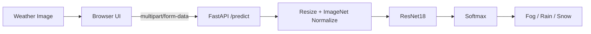

# AI Weather Classifier

A computer-vision application that classifies weather scenes into **fog**, **rain**, and **snow** using a pretrained **ResNet18** model with transfer learning. The project includes a browser interface, a FastAPI inference service, reproducible training/evaluation scripts, and GPU-aware inference.

## Results

| Metric | Result |
|---|---:|
| Validation accuracy | **93.29%** |
| Validation samples | 417 |
| Correct predictions | 389 |
| Classes | Fog / Rain / Snow |
| Input size | 224 × 224 RGB |
| Inference | PyTorch + FastAPI |

> **Important:** 93.29% is the measured accuracy on the held-out validation split. The external test images in `data/3_3_test_fin/test` are unlabeled, so this project does **not** claim test-set accuracy.

## Architecture



## Project structure

```text
AI-Weather-Classifier/
├── backend/
│   └── main.py
├── frontend/
│   ├── index.html
│   ├── script.js
│   └── style.css
├── models/
│   └── README.md
├── reports/
├── data/                  # local dataset; ignored by Git
├── train.py
├── evaluate.py
├── predict.py
├── requirements.txt
├── .gitignore
└── README.md
```

## Local setup

### 1. Install Python dependencies

A recent Python installation is recommended. For GPU acceleration, install the PyTorch build appropriate for your NVIDIA/CUDA environment before starting the API.

```bash
python -m pip install -r requirements.txt
```

### 2. Add the dataset

Place the labelled training data at:

```text
data/3_3_train/train/fog/
data/3_3_train/train/rain/
data/3_3_train/train/snow/
```

The unlabeled external test images can be placed at:

```text
data/3_3_test_fin/test/
```

The dataset is ignored by Git because raw image collections do not belong in the source repository.

### 3. Train the model

```bash
python train.py
```

The best checkpoint is written to `models/weather_resnet18.pth`.

### 4. Evaluate the validation split

```bash
python evaluate.py
```

This recreates the same 80/20 split (seed `42`) and writes `reports/evaluation_report.txt`.

### 5. Run a prediction

Single image:

```bash
python predict.py "data/3_3_test_fin/test/0.png"
```

All unlabeled test images:

```bash
python predict.py
```

The batch predictions are written to `reports/weather_predictions.csv`.

### 6. Start the API

```bash
python -m uvicorn backend.main:app --reload
```

Open the interactive API documentation at `http://127.0.0.1:8000/docs`.

### 7. Serve the frontend

From the repository root:

```bash
python -m http.server 5500
```

Then open:

```text
http://127.0.0.1:5500/frontend/index.html
```

The frontend sends uploaded images to `POST /predict` and does not generate fake predictions when the backend is unavailable.

## API

### `GET /health`

Returns backend status and the selected device.

### `POST /predict`

Multipart field: `file`

Example response:

```json
{
  "prediction": "rain",
  "confidence": 99.96,
  "probabilities": {
    "fog": 0.01,
    "rain": 99.96,
    "snow": 0.03
  },
  "validation_accuracy": 93.29,
  "device": "cuda"
}
```

## Notes on confidence

The displayed confidence is the model's softmax output for one image. It is **not** the same thing as accuracy, and it should not be interpreted as a guarantee that the prediction is correct.

## Why the repository excludes the dataset and checkpoint

The repository is designed to keep source code lightweight and reviewable. Raw image data and trained binary checkpoints are ignored by Git. Anyone reproducing the project can train the checkpoint locally using the included `train.py` script.

## License

MIT. See `LICENSE`.