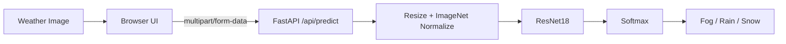

# AI Weather Classifier

A computer-vision application that classifies weather scenes into **fog**, **rain**, and **snow** using a pretrained **ResNet18** model with transfer learning. The project includes a browser interface, a FastAPI inference service, reproducible training/evaluation scripts, and GPU-aware inference.

## Results

| Metric | Result |
|---|---:|
| Validation accuracy | **93.29%** |
| Validation samples | 417 |
| Correct predictions | 389 |
| Classes | Fog / Rain / Snow |
| Input size | 224 × 224 RGB |
| Inference | PyTorch + FastAPI |

> **Important:** 93.29% is the measured accuracy on the held-out validation split. The external test images in `data/3_3_test_fin/test` are unlabeled, so this project does **not** claim test-set accuracy.

## Architecture



## Project structure

```text
AI-Weather-Classifier/
├── api/
│   └── index.py           # Vercel FastAPI entrypoint
├── backend/
│   └── main.py            # FastAPI application
├── frontend/
│   ├── index.html
│   ├── script.js
│   └── style.css
├── models/
│   └── README.md
├── reports/
├── data/                  # local dataset; ignored by Git
├── train.py
├── evaluate.py
├── predict.py
├── requirements.txt
├── pyproject.toml
├── vercel.json
├── .python-version
├── .gitignore
└── README.md
```

## Local setup

### 1. Install Python dependencies

```bash
python -m pip install -r requirements.txt
```

### 2. Add the dataset

Place the labelled training data at:

```text
data/3_3_train/train/fog/
data/3_3_train/train/rain/
data/3_3_train/train/snow/
```

The unlabeled external test images can be placed at:

```text
data/3_3_test_fin/test/
```

### 3. Train the model

```bash
python train.py
```

The best checkpoint is written to `models/weather_resnet18.pth`.

### 4. Evaluate the validation split

```bash
python evaluate.py
```

This recreates the same 80/20 split (seed `42`) and writes `reports/evaluation_report.txt`.

### 5. Run a prediction

```bash
python predict.py "data/3_3_test_fin/test/0.png"
```

### 6. Start the API locally

```bash
python -m uvicorn backend.main:app --reload
```

Open `http://127.0.0.1:8000/docs`.

### 7. Serve the frontend locally

```bash
python -m http.server 5500
```

Then open:

```text
http://127.0.0.1:5500/frontend/index.html
```

The standalone local frontend uses `http://127.0.0.1:8000/predict` by default. The deployed Vercel frontend automatically uses `/api/predict` on the same origin.

## Vercel deployment

The repository contains a Vercel-compatible entrypoint at `api/index.py` and routing in `vercel.json`. Vercel's Python runtime supports FastAPI and uses `api/index.py` as the function entrypoint. citeturn425471search1turn425471search3

The Python runtime is pinned to 3.12 because Vercel currently supports 3.12, 3.13, and 3.14, with 3.12 as the documented default. citeturn425471search0turn425471search1

The frontend is rewritten from `/` to `frontend/index.html`, with its CSS and JavaScript served from the corresponding `frontend/` files. The browser calls `/api/predict`, so production does not depend on a user's localhost machine.

### Model requirement

The trained checkpoint is **not committed** to Git. Without `models/weather_resnet18.pth`, the deployment can still boot, but the API reports `model_loaded: false` and prediction requests return HTTP 503 instead of crashing the whole deployment. For actual hosted inference, the checkpoint must be supplied to the deployed runtime.

Because PyTorch is a large dependency, a Vercel function can also run into its Python bundle-size limit. Vercel documents techniques for controlling what gets bundled, and its Python runtime documentation notes a 500 MB bundle limit. citeturn425471search1 A production-friendly next step is to export the trained ResNet18 checkpoint to ONNX and serve it with `onnxruntime`, which is substantially lighter than shipping the full PyTorch stack.

## API

### `GET /api/health`

Returns deployment/device/model status.

### `POST /api/predict`

Multipart field: `file`.

Example response:

```json
{
  "prediction": "rain",
  "confidence": 99.96,
  "probabilities": {
    "fog": 0.01,
    "rain": 99.96,
    "snow": 0.03
  },
  "validation_accuracy": 93.29,
  "device": "cpu"
}
```

## Notes on confidence

The displayed confidence is the model's softmax output for one image. It is **not** the same thing as accuracy, and it should not be interpreted as a guarantee that the prediction is correct.

## License

MIT. See `LICENSE`.
